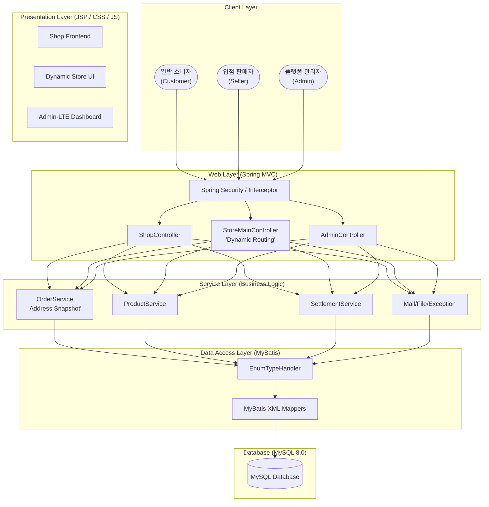
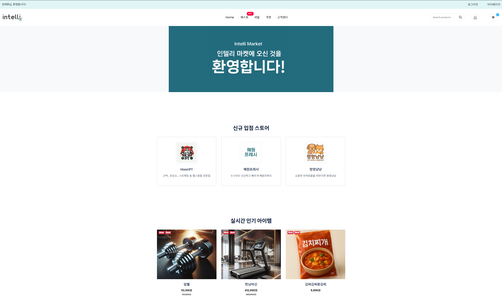
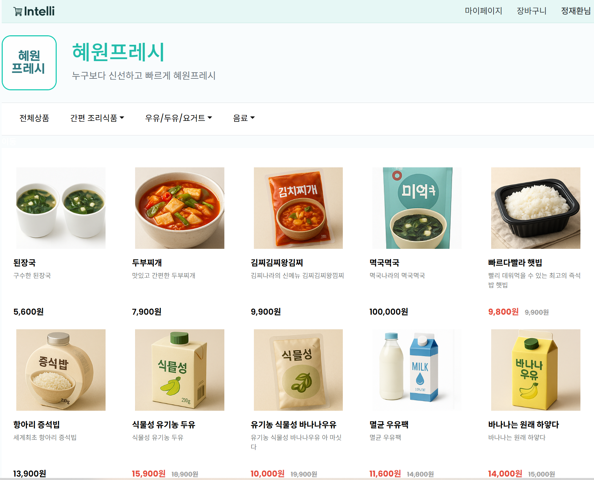
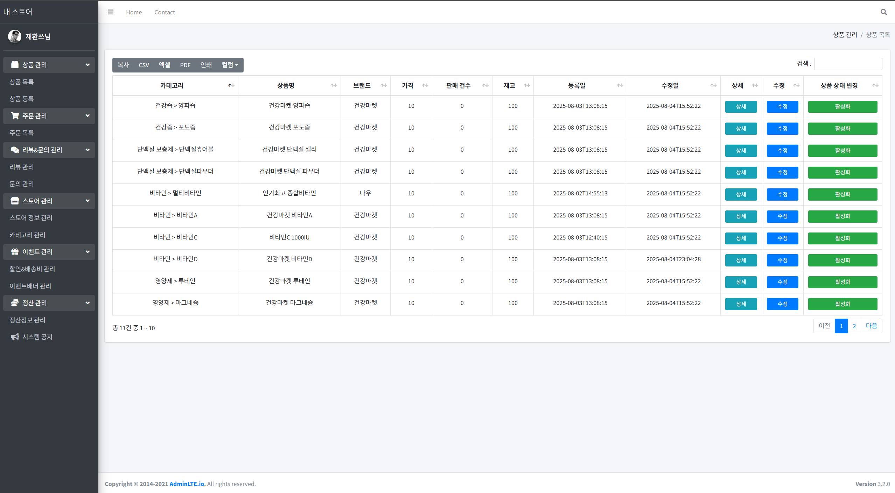

# 🛒 Intelli Market
> **다수 판매자의 독립 스토어 운영을 지원하는 데이터 주도형 오픈마켓 플랫폼**

<!-- [](https://www.java.com/)
[](https://spring.io/)
[](https://blog.mybatis.org/)
[](https://www.mysql.com/)
[](https://maven.apache.org/) -->

## 1. 프로젝트 소개
**Intelli Market**은 네이버 스마트스토어의 핵심 아키텍처를 벤치마킹하여 개발된 이커머스 플랫폼입니다. 단일 플랫폼 내에서 수많은 판매자가 자신만의 고유 URL(`engName`)과 브랜드 정체성을 가진 독립 스토어를 즉시 생성하고 운영할 수 있도록 데이터 주도형 아키텍처를 적용했습니다.

---

## 2. 주요 기능
### 👤 소비자 (Shop)
- **상품 탐색**: 카테고리별 상품 조회 및 실시간 검색.
- **주문 프로세스**: 장바구니 담기, 결제 연동, 배송지 관리.
- **마이페이지**: 실시간 주문 현황 트래킹

### 👨‍🏫 판매자 (Store)
- **독립 스토어 관리**: 스토어 이름, 주소(URL), 로고 및 카테고리 커스텀 마이징
- **비즈니스 운영**: 상품 등록/수정, 재고 관리, 실시간 주문 접수 및 배송 처리.
- **정산 시스템**: 판매 대금 정산 요청 및 월별 매출 분석 이력 조회.

### 👑 플랫폼 관리자 (Admin)
- **입점 제어**: 판매자 입점 신청 승인/반려 및 회원 권한 관리.
- **마케팅 운영**: 메인 배너 및 전사 이벤트 관리, 고객 센터 FAQ 관리.

---

## 3. 기술 스택
| Category | Tech Stack |
| :--- | :--- |
| **Language/Framework** | Java 8, Spring MVC 4.3, Spring Security 4.2 |
| **Persistence** | MyBatis 3.4, MySQL 8.0 (Ubuntu 24.04 LTS) |
| **View/Frontend** | JSP, JSTL, Admin-LTE (Dashboard), Vanilla CSS/JS |
| **Build/Server** | Maven, Apache Tomcat 8.5 |

---

## 4. 빠른 시작 (Quick Start)
```bash
# 1. 레포지토리 클론
git clone https://github.com/rekindle402/intellimarket

# 2. 데이터베이스 구성
# 루트 경로의 DDL.txt를 참고하여 MySQL 스키마 및 초기 데이터 생성

# 3. 서버 설정 및 실행
# STS 또는 IntelliJ에서 Tomcat 8.5 서버에 프로젝트 배포 후 실행
```

---

## 5. 상세 디렉토리 구조
```text
src/main/java/com/intellimarket
├── admin                       # 플랫폼 관리자 도메인
│   ├── controller              # 회원/스토어 승인, 배너 관리 컨트롤러
│   ├── dao                     # 관리자 전역 데이터 액세스
│   ├── domain                  # 관리자 관련 도메인 모델 (Banner 등)
│   ├── exception               # 관리자 비즈니스 예외 처리
│   └── service                 # 플랫폼 전사 관리 로직
├── shop                        # 소비자 서비스 도메인
│   ├── controller              # 상품 조회, 장바구니, 주문/결제 컨트롤러
│   ├── dao                     # 주문, 회원, 장바구니 데이터 액세스
│   ├── domain                  # 주문(Order), 회원(Member), 장바구니(Cart) 모델
│   ├── exception               # 쇼핑몰 비즈니스 예외 처리
│   └── service                 # 결제 및 트랜잭션 관리 로직
├── store                       # 판매자 및 독립 스토어 도메인
│   ├── controller              # 동적 경로 스토어 홈, 상품 관리, 정산 컨트롤러
│   ├── dao                     # 상품, 정산, 스토어 메타데이터 데이터 액세스
│   ├── domain                  # 상품(Product), 스토어(StoreInfo), 정산 모델
│   ├── exception               # 스토어 운영 관련 비즈니스 예외 처리
│   └── service                 # 계층형 카테고리 및 판매 비즈니스 로직
├── common                      # 공통 모듈 및 인프라
│   ├── controller, service     # 이메일 인증 등 전사 공통 기능
│   ├── util                    # Session, Cookie, File, 암호화 유틸리티
│   └── exception               # 전역 예외 처리기 (GlobalExceptionHandler)
└── config                      # 시스템 환경 설정
    ├── MyBatis, WebMvc, Security, AppConfig, TypeHandler
```

---

## 6. 시스템 아키텍처 및 설계 특징

### 📐 시스템 아키텍처 (Logical Architecture)



#### [아키텍처 설계 특징]
*   **계층형 아키텍처 (Layered Architecture)**: Presentation, Web, Service, Data Access 계층을 엄격히 분리하여 관심사를 격리하고 유지보수성을 극대화했습니다.
*   **도메인 기반 패키지 구조**: `admin`, `shop`, `store` 패키지로 도메인을 논리적으로 분리하여 각 페르소나(관리자/소비자/판매자)에 최적화된 비즈니스 로직을 독립적으로 관리합니다.
*   **동적 뷰 바인딩 시스템**: 하나의 공통 레이아웃을 기반으로 DB에서 조회한 판매자별 메타데이터(로고, 색상, 카테고리)를 실시간 주입하여 수만 개의 독립 스토어를 동적으로 렌더링합니다.
*   **전역 예외 및 보안 관리**: Spring Security와 커스텀 인터셉터를 통한 접근 제어, `@ControllerAdvice`를 활용한 전역 예외 처리를 통해 시스템의 안정성과 보안성을 확보했습니다.

### 💡 핵심 설계 포인트
- **데이터 주도형 동적 라우팅**: `@PathVariable`을 활용하여 `/store/{engName}` 형태의 판매자별 독립 URL을 구현하고, DB에 저장된 스토어별 메타데이터를 실시간으로 뷰에 바인딩합니다.
- **주문 데이터 무결성 (Snapshot 전략)**: 회원이 주소를 수정하더라도 과거 주문 내역의 배송지가 변하지 않도록, 주문 시점의 주소를 `orders` 테이블에 문자열 형태로 직접 저장(Denormalization)합니다.
- **객체 지향적 카테고리 매핑**: `Root > Top > Sub`로 이어지는 3단계 정규화 테이블 구조를 MyBatis의 `Association`과 `Collection` 매핑을 통해 복합 객체 구조로 바인딩하여 조회 성능과 유연성을 확보했습니다.

---

## 7. API 및 데이터 응답 예제

### [스토어별 상품 목록 조회]
- **Endpoint**: `GET /store/{engName}/all`
- **Description**: 특정 스토어의 전체 상품 목록을 반환합니다.

### 7-1. 응답 데이터 (JSON)
```json
[
  {
    "productId": 102,
    "productName": "Intelli Mechanical Keyboard",
    "price": 125000,
    "productStatus": "FOR_SALE",
    "imageUrl": "/resources/img/product/kb_01.jpg"
  },
  {
    "productId": 105,
    "productName": "Wireless Mouse G",
    "price": 45000,
    "productStatus": "SOLD_OUT",
    "imageUrl": "/resources/img/product/mouse_05.jpg"
  }
]
```

---

## 8. 데이터베이스 모델링 (ERD)
<!-- ERD 이미지를 여기에 넣으세요 -->
> 

---

## 🖼️ 주요 화면 구성
<!-- 주요 화면 스크린샷을 여기에 넣으세요 -->
| 소비자 메인 | 독립 스토어 홈 | 판매자 어드민 |
| :---: | :---: | :---: |
|  |  |  |

---

## 👥 프로젝트 참여 인원 및 역할
| 이름 | 역할 | 담당 업무 및 기여 내용 |
| :--- | :---: | :--- |
| **정재환** | **팀장** | 전사 ERD 설계 및 구축, 동적 스토어 아키텍처 설계, 주문 주소 스냅샷 전략 수립 |
| **구지훈** | 팀원 | 판매자 어드민 시스템(Admin-LTE) 구축, 상품/재고 관리 및 정산 프로세스 구현 |
| **박혜원** | 팀원 | 공통 모듈 및 전역 예외 처리 설계, 인증/인가 보안 및 MyBatis 커스텀 핸들러 구현 |
| **신주원** | 팀원 | 소비자 구매 여정(Flow) 설계, 장바구니 및 주문/결제 프로세스 구현 |
